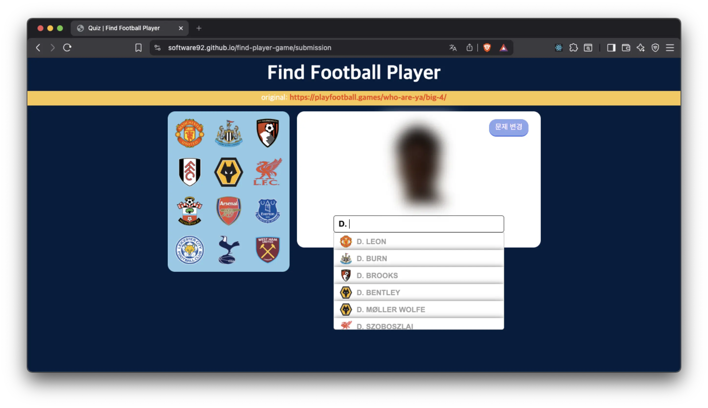

# ⚽ Find Football Player Quiz

[](https://swjeon-dev.github.io/find-player-game/) 

블러 처리된 프리미어리그 선수 사진을 보고 이름을 맞히는 **축구 선수 퀴즈**입니다.  
**CRA + JavaScript**로 시작한 프로젝트를 **Vite + TypeScript**로 옮기고, API·DB 제약 속에서도 **쓰기 편한 검색·퀴즈 경험**을 만드는 데 집중했습니다.

## 데모

- [Live Demo](https://swjeon-dev.github.io/find-player-game/)
- [시연 영상](https://github.com/user-attachments/assets/37036cd6-3ea5-42fa-837c-c987919557b6)

[](https://github.com/user-attachments/assets/37036cd6-3ea5-42fa-837c-c987919557b6)

## 기술 포인트

- **외부 API Rate Limit** — 클라이언트 직접 호출 대신 Firebase(Cloud Functions + Realtime Database)로 조회
- **id 기반 DB + prefix 검색 제약** — **커버·리그 모달·hover prefetch**로 조회·화면 흐름을 바꿔 체감 대기 완화 (Lighthouse 홈 LCP **24.5s → 3.2s**, TBT **690ms → 0ms**, [상세](docs/portfolio.md#perf-compare))
- **React Query** — 캐싱·persist, 리그·팀 hover 시 미리 조회
- **입력·화면** — prefix 자동완성, route lazy loading, 오답 힌트 / 정답 시 UI 전환
- **코드 구조** — `components/`, `hooks/` 등 역할별 폴더를 **FSD 기준 리팩터링** (`pages` → `widget` → `entities`, `features`는 규모상 미도입)

## 주요 기능

- 블러 이미지 퀴즈, prefix 자동완성
- 팀 메뉴 hover로 선수 이름 확인 후 입력
- 오답 시 힌트, 정답 시 원본 이미지·입력 비활성화

## 기술 스택

React · TypeScript · Vite · Styled Components · React Query · Recoil · Firebase · GitHub Actions

## 실행

```bash
npm install
npm run dev
```
